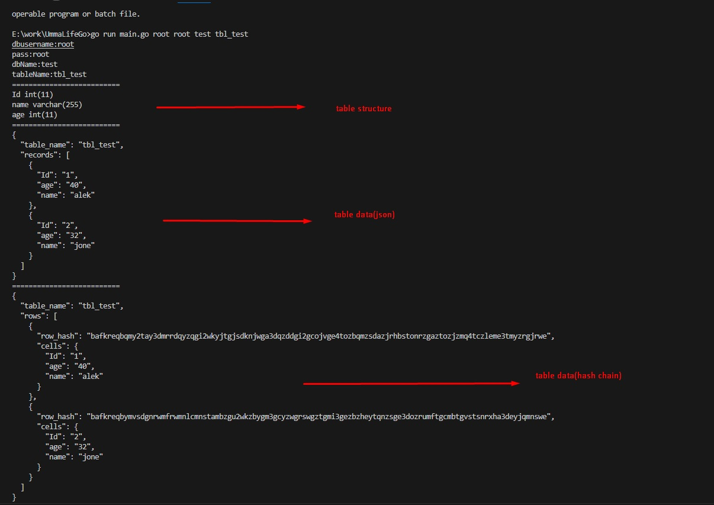

# Umma-Life-Go TEST

## Table of Contents

- [Installation](#installation)
- [Usage](#usage)
- [WorkHistory](#workhistory)

## Installation

    Clone the repository.
   
    git clone https://github.com/trayanus1026/UmmaLifeGo.git

    cd UmmaLifeGo

## Usage
    
    go run main.go <db_username> <db_password> <db_name> <table_name>

    example : go run main.go root root test tbl_test

## WorkHistory

    go mod init github.com/trayanus1026/umma-life-go
    go get -u github.com/go-sql-driver/mysql
    go get -u github.com/ipfs/go-ipfs-api
    go get -u github.com/ipfs/go-cid
    go get -u github.com/multiformats/go-multihash
    go build -o main main.go
    go build main.go
    ./main <db_username> <db_password> <db_name> <table_name>
    go run main.go root root test tbl_test

